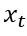
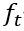
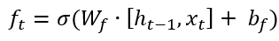
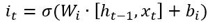
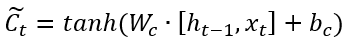
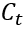
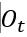
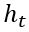
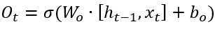
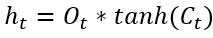

# 项目名称：
使用 LSTM 模型来对进行实体识别

# 项目环境：
pytorch、python   
相关库安装
`pip install -r requirement.txt`

# 项目目录：
```
|--LSTM 命名实体识别
    |--data             数据
    |--model            保存的模型
    |--config.py        配置文件
    |--main.py          主函数
    |--MyModel.py       模型文件
    |--predict.py       预测文件
    |--requirement.txt  安装库文件
    |--tools.py         数据处理文件
```

# 模型介绍
LSTM(Long_short_term_memory),使用LSTM模型可以更好的捕捉到较长距离的依赖关系，通过训练可以学到记忆那些信息和遗忘那些信息，
能解决梯度爆炸和梯度弥散问题，可以处理更长的文本数据。         
遗忘门（记忆门）：         
输入：前一时刻的隐层状态.png)，当前时刻的输入词    
输出：遗忘门的值        
       
输入门：     
输入：前一时刻的隐层状态.png)，当前时刻的输入词    
输出：记忆门的值%20̃.png)，临时细胞状态%20̃.png)
     
     
输出门：     
输入：前一时刻的隐层状态.png)，当前时刻的输入词，当前时刻细胞状态        
输出：输出们的，隐层状态
     


[LSTM 模型视频讲解](https://www.bilibili.com/video/BV1if4y1x7vf?p=8&vd_source=946c3fb8fdb85266f0efe9377f81df78)

# 项目数据集
数据集用的是论文[【ACL 2018Chinese NER using Lattice LSTM】](https://github.com/jiesutd/LatticeLSTM)中从新浪财经收集的简历数据。

# 模型训练
`python main.py`

# 模型预测
`python predict.py`


